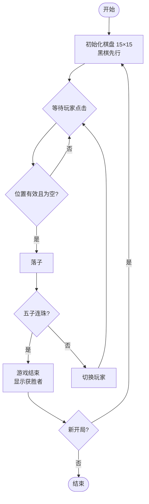

# 1.3.1 双人对战模式流程图

```mermaid
flowchart TD
    A([开始]) --> B[初始化棋盘 15×15<br/>黑棋先行]
    B --> C{等待玩家点击}
    C --> D{位置有效且为空?}
    D -->|否| C
    D -->|是| E[落子]
    E --> F{五子连珠?}
    F -->|是| G[游戏结束<br/>显示获胜者]
    F -->|否| H[切换玩家]
    H --> C
    G --> I{新开局?}
    I -->|是| B
    I -->|否| J([结束])
```

## 简化说明

- 去除了子图分组
- 合并了重复的状态检查
- 精简为9个核心节点
