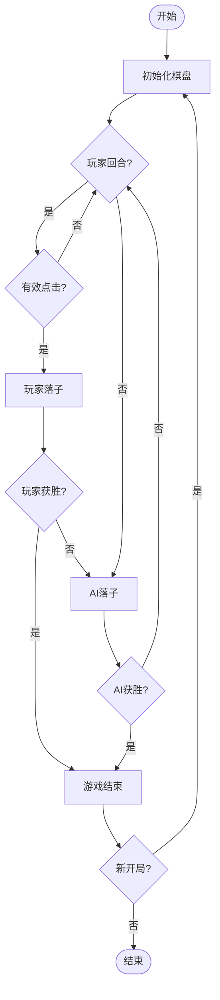

# 1.3.2 人机对战模式流程图

```mermaid
flowchart TD
    A([开始]) --> B[初始化棋盘]
    B --> C{玩家回合?}
    C -->|是| D{有效点击?}
    D -->|否| C
    D -->|是| E[玩家落子]
    E --> F{玩家获胜?}
    F -->|是| G[游戏结束]
    F -->|否| H[AI落子]
    C -->|否| H
    H --> I{AI获胜?}
    I -->|是| G
    I -->|否| C
    G --> J{新开局?}
    J -->|是| B
    J -->|否| K([结束])
```
